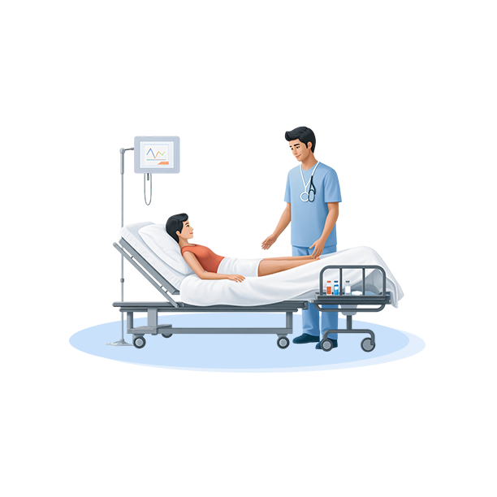
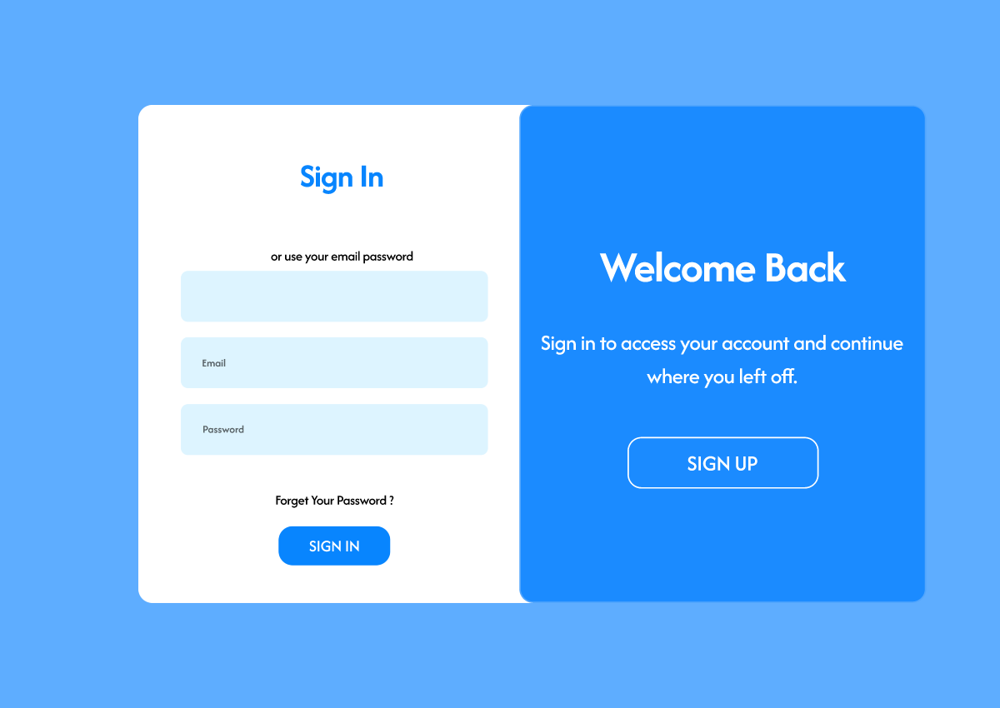
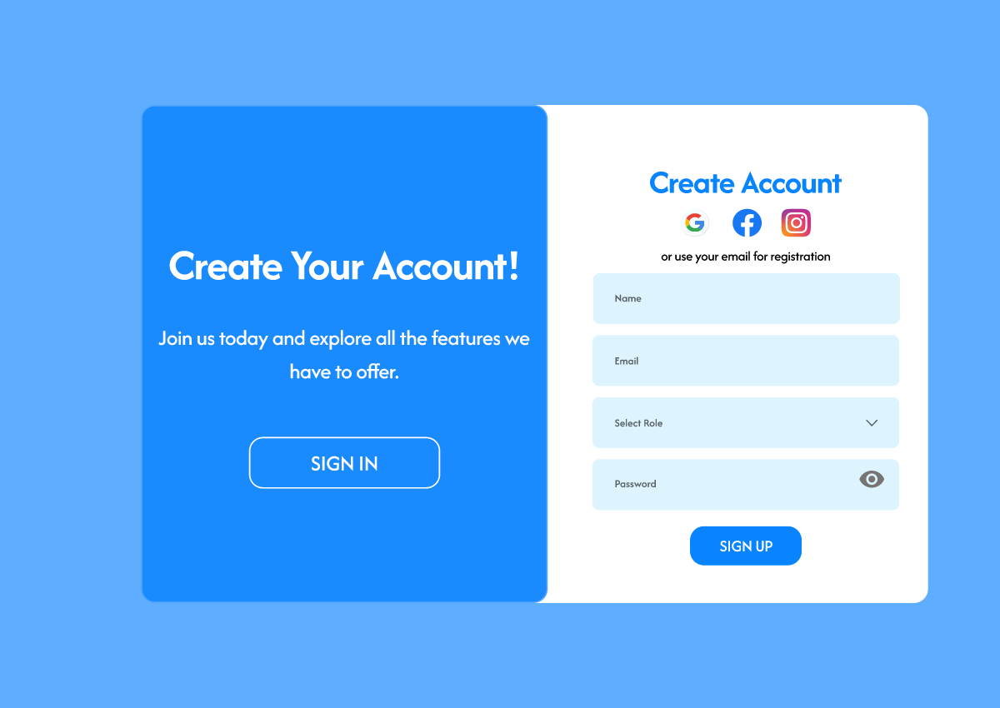
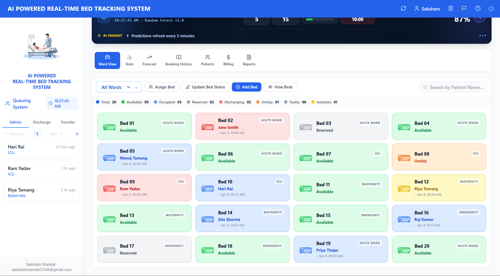
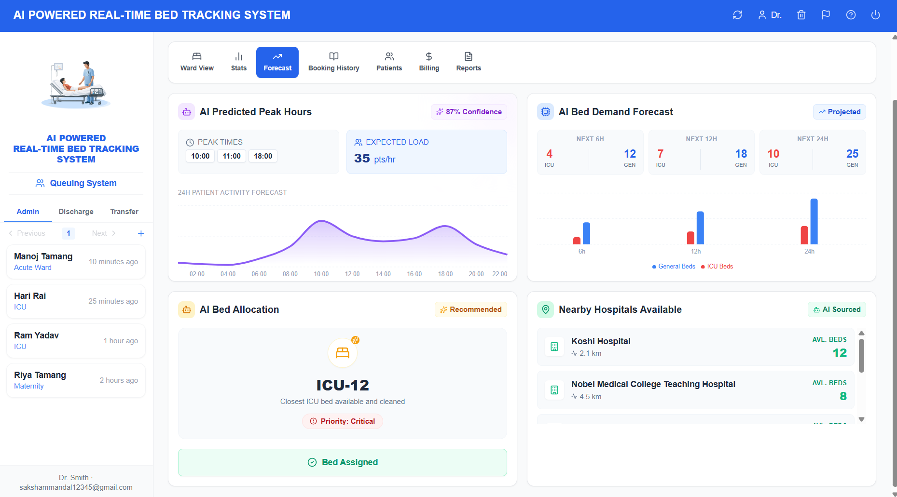
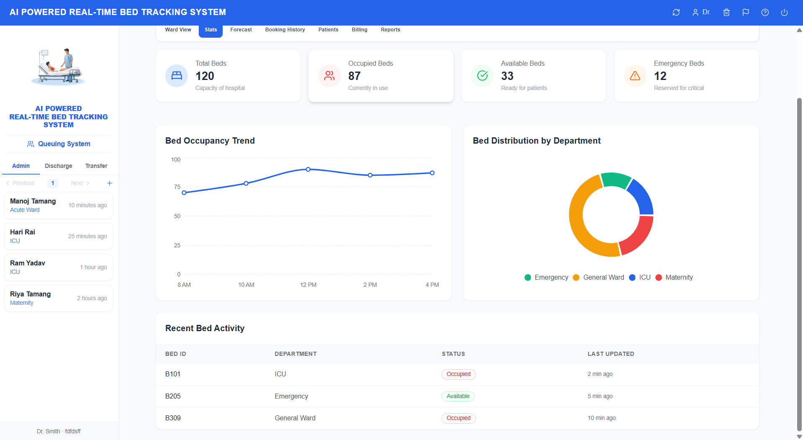
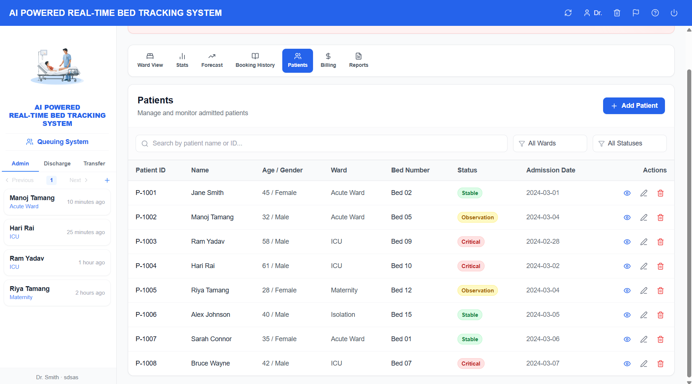
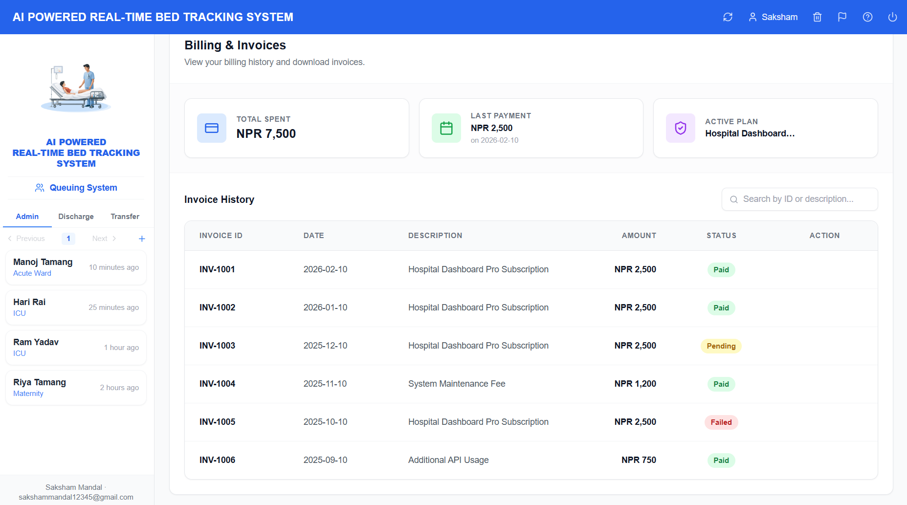

<p align="center">
  
</p>

<h1 align="center">🏥 AI-Powered Real-Time Bed Tracking System</h1>

<p align="center">
  <b>A smart hospital bed management dashboard built with React — designed to optimize bed allocation, reduce patient wait times, and streamline hospital operations.</b>
</p>

<p align="center">
  
  
  
  
  
</p>

---

## 📋 Table of Contents

- [About the Project](#-about-the-project)
- [Problem Statement](#-problem-statement)
- [How It Works](#-how-it-works)
- [Features](#-features)
- [Screenshots](#-screenshots)
- [Tech Stack](#-tech-stack)
- [Project Structure](#-project-structure)
- [Getting Started](#-getting-started)
- [Usage](#-usage)
- [Roadmap](#-roadmap)
- [Contributing](#-contributing)
- [License](#-license)

---

## 🎯 About the Project

The **AI-Powered Real-Time Bed Tracking System** is a modern web application designed for hospitals and healthcare facilities to manage bed availability, patient assignments, and queue management in real time. It provides administrators, nurses, and billing staff with a centralized dashboard to monitor bed statuses across multiple wards — enabling faster decision-making and reducing delays in patient admissions.

---

## ❗ Problem Statement

Hospitals worldwide face critical challenges with bed management:

| Problem | Impact |
|---|---|
| **Manual bed tracking** | Staff waste hours calling wards to check bed availability |
| **No real-time visibility** | Administrators can't see which beds are free, occupied, or under maintenance at a glance |
| **Long patient wait times** | Patients queue for hours while beds sit empty in other wards |
| **Inefficient discharge flow** | Discharged beds stay marked as occupied, blocking new admissions |
| **No priority-based allocation** | Critical patients wait the same as non-urgent cases |
| **Reactive rather than proactive** | Cannot predict incoming patient surges or forecast bed demand |

> **This system solves all of these problems** by providing a real-time, color-coded dashboard, **AI-powered predictive analytics**, full CRUD operations, a priority-based patient queue, and ward-level filtering — all accessible from any browser.

---

## ⚙️ How It Works

```
┌─────────────────────────────────────────────────────────────┐
│                     USER AUTHENTICATION                      │
│   Login / Register → Role Assignment (Admin/Nurse/Billing)   │
└──────────────────────────┬──────────────────────────────────┘
                           │
                           ▼
┌─────────────────────────────────────────────────────────────┐
│                      MAIN DASHBOARD                          │
│                                                              │
│  ┌──────────────┐    ┌──────────────────────────────────┐   │
│  │   SIDEBAR     │    │          WARD VIEW                │   │
│  │              │    │                                    │   │
│  │ Hospital     │    │  [Ward Filter] [CRUD Actions]     │   │
│  │ Branding     │    │                                    │   │
│  │              │    │  Status Legend Bar                 │   │
│  │ ─────────── │    │  (Total/Available/Occupied/...)    │   │
│  │              │    │                                    │   │
│  │ Queuing     │    │  ┌────────┐  ┌────────┐           │   │
│  │ System      │    │  │ Bed 01 │  │ Bed 02 │           │   │
│  │              │    │  │ Avail. │  │ Disch. │           │   │
│  │ Admin|Disch │    │  └────────┘  └────────┘           │   │
│  │ |Transfer   │    │  ┌────────┐  ┌────────┐           │   │
│  │              │    │  │ Bed 03 │  │ Bed 04 │           │   │
│  │ Patient     │    │  │ Rsrvd. │  │ Avail. │           │   │
│  │ Queue List  │    │  └────────┘  └────────┘           │   │
│  └──────────────┘    └──────────────────────────────────┘   │
└─────────────────────────────────────────────────────────────┘
```

### Workflow:
1. **Authenticate** — Staff sign in with their credentials and are assigned a role (Admin, Nurse, Billing, Viewer)
2. **View Dashboard** — The main dashboard displays all beds as color-coded cards in a grid layout
3. **Filter by Ward** — Use the dropdown to filter beds by ward (Acute Ward, ICU, Maternity, Isolation)
4. **Manage Beds** — Click any bed card to:
   - **Available beds** → Open the **Assign Patient** modal to assign a queued patient
   - **Occupied/Other beds** → Open the **Update Status** modal to change status or discharge
5. **Add New Beds** — Use the **"+ Add Bed"** button to register new beds to any ward
6. **Patient Queue** — The sidebar shows patients waiting for beds, organized into tabs:
   - **Admin** — New admissions waiting for beds
   - **Discharge** — Patients pending discharge
   - **Transfer** — Patients waiting for ward transfers

---

## ✨ Features

### 🤖 AI-Powered Analytics
- **Peak Hour Prediction** — Analyzes admission patterns to identify daily peak times
- **Bed Demand Forecasting** — Predicts required bed count for upcoming days
- **Emergency Surge Alerts** — Warns staff of sudden incoming patient loads based on historical data
- **Nearby Hospital Allocations** — Suggests transferring patients to nearby facilities when capacity is reached
- **Smart Bed Allocation** — Recommends best bed assignment based on priority and ward type

### 🔐 Authentication & Authorization
- Secure login and registration with form validation
- Role-based access control (Admin, Nurse, Billing, Viewer)
- Persistent sessions via localStorage
- Protected routes — unauthorized users are redirected to login

### 🛏️ Bed Management (Full CRUD)
- **Create** — Add new beds with bed number, ward, and initial status
- **Read** — View all beds in a responsive grid with real-time status indicators
- **Update** — Change bed status (Available → Occupied → Discharging → Untidy → Available)
- **Delete** — Remove beds from the system

### 🧑‍⚕️ Patient Management (Full CRUD)
- **Create** — Add new patient records with details like age, blood group, and clinical notes
- **Read** — View patient directory in a responsive desktop table or mobile cards
- **Update** — Edit existing patient information seamlessly
- **Delete** — Remove patients from the system

### 🎨 8 Color-Coded Bed Statuses
| Status | Color | Meaning |
|---|---|---|
| 🟢 Available | Green | Ready for new patient |
| 🔵 Occupied | Blue | Currently has a patient |
| ⚪ Reserved | Gray | Reserved for incoming patient |
| 🔴 Discharging | Red | Patient being discharged |
| 🟠 Untidy | Orange | Needs cleaning after discharge |
| 🩶 Faulty | Slate | Under maintenance/repair |
| 🟡 Isolation | Yellow | Isolation protocol active |

### 👥 Patient Queue System
- Three-tab queue: **Admin**, **Discharge**, **Transfer**
- Priority levels: High, Medium, Low
- Paginated queue list (4 patients per page)
- Assign patients directly from queue to available beds

### 📊 Dashboard Sections
- **Ward View** — Main bed grid with filters and CRUD actions
- **AI Analytics** — Includes demand forecasting, peak hour predictions, and surge alerts
- **Stats** — Statistical overview 
- **Forecast** — AI-based occupancy predictions
- **Booking History** — Past admissions log
- **Patients** — Full CRUD patient directory with search and filtering
- **Billing** — Invoice management & billing history
- **Reports** — Analytics reports *(coming soon)*

### 🔍 Search & Filter
- Real-time search by bed number, patient name, or status
- Ward-level filtering (All Wards, Acute Ward, ICU, Maternity, Isolation)

---

## 📸 Screenshots

### Login Page
> Clean split-panel design with sign-in form and welcome message



### Registration Page
> Create account with role selection (Admin, Nurse, Billing, Viewer) and social sign-up options



### Dashboard — Ward View
> Main dashboard showing bed grid, sidebar with patient queue, action toolbar, and status legend



### Dashboard — AI Forecast View
> AI analytics dashboard showing predicted peak hours, bed demand forecasting, smart bed allocations, and nearby hospital availability.



### Dashboard — Stats View
> Statistical overview displaying real-time hospital capacity, bed occupancy trends, department distributions, and recent activity.



### Dashboard — Patients View
> Complete CRUD interface for managing patient records, searching, and filtering hospital admissions.



### Dashboard — Billing View
> Manage billing history, track expenses, and view detailed invoices.



---

## 🛠️ Tech Stack

| Layer | Technology | Purpose |
|---|---|---|
| **Frontend** | React 19 | Component-based UI with hooks |
| **Build Tool** | Vite 7 | Lightning-fast HMR and bundling |
| **Styling** | TailwindCSS 3 | Utility-first responsive design |
| **Routing** | React Router 7 | Client-side routing with protected routes |
| **Icons** | Lucide React | Beautiful, consistent icon set |
| **State** | React Context API | Global state for beds, queue, and auth |
| **Code Quality** | ESLint 9 | Linting with React Hooks plugin |

---

## 📂 Project Structure

```
ai-bed-tracking-system/
├── public/                      # Static assets
├── src/
│   ├── assets/                  # Images (hospital.png, react.svg)
│   ├── components/
│   │   ├── ai/                  # AI-powered prediction & analysis components
│   │   │   ├── BedDemandForecast.jsx
│   │   │   ├── BedRecommendation.jsx
│   │   │   ├── EmergencySurgeAlert.jsx
│   │   │   ├── NearbyHospitals.jsx
│   │   │   └── PeakHourPrediction.jsx
│   │   ├── beds/                # Bed management components
│   │   │   ├── AddBedModal.jsx      # Modal to create a new bed
│   │   │   ├── AssignBedModal.jsx   # Modal to assign patient to bed
│   │   │   ├── BedCard.jsx          # Individual bed card with status
│   │   │   ├── BedGrid.jsx          # Grid layout for bed cards
│   │   │   └── UpdateStatusModal.jsx# Modal to update bed status
│   │   ├── layout/              # App layout shell
│   │   │   ├── Layout.jsx           # Main layout wrapper
│   │   │   ├── Sidebar.jsx          # Sidebar with queue system
│   │   │   └── Topbar.jsx           # Top navigation bar
│   │   ├── queue/               # Patient queue components
│   │   │   └── QueueList.jsx        # Queue list display
│   │   └── ui/                  # Reusable UI primitives
│   │       ├── Badge.jsx            # Status badges
│   │       ├── Button.jsx           # Button component
│   │       ├── Input.jsx            # Input component
│   │       └── Modal.jsx            # Modal dialog component
│   ├── context/                 # React Context providers
│   │   ├── AuthContext.jsx          # Authentication state & methods
│   │   └── BedContext.jsx           # Bed & queue state & CRUD methods
│   ├── data/
│   │   └── mockData.js              # Initial beds, queue, wards, statuses
│   ├── pages/                   # Page-level components
│   │   ├── Dashboard.jsx            # Main dashboard page
│   │   ├── Login.jsx                # Login page
│   │   └── Register.jsx            # Registration page
│   ├── routes/                  # Routing configuration
│   │   ├── AppRoutes.jsx            # Route definitions with lazy loading
│   │   └── ProtectedRoute.jsx      # Auth guard for protected routes
│   ├── App.jsx                  # Root component
│   ├── App.css                  # Global styles
│   ├── index.css                # TailwindCSS directives
│   └── main.jsx                 # Entry point
├── index.html                   # HTML template
├── package.json                 # Dependencies & scripts
├── tailwind.config.js           # TailwindCSS configuration
├── postcss.config.js            # PostCSS configuration
├── vite.config.js               # Vite configuration
└── eslint.config.js             # ESLint configuration
```

---

## 🚀 Getting Started

### Prerequisites

- **Node.js** ≥ 18.x
- **npm** ≥ 9.x (or **yarn** / **pnpm**)

### Installation

1. **Clone the repository**
   ```bash
   git clone https://github.com/your-username/ai-bed-tracking-system.git
   cd ai-bed-tracking-system
   ```

2. **Install dependencies**
   ```bash
   npm install
   ```

3. **Start the development server**
   ```bash
   npm run dev
   ```

4. **Open in browser**
   ```
   http://localhost:5173
   ```

### Build for Production

```bash
npm run build
npm run preview    # Preview the production build
```

---

## 💡 Usage

### Login Credentials (Mock Auth)
The system uses mock authentication. You can sign in with any email and password:

| Email Pattern | Assigned Role |
|---|---|
| Any email with `nurse` | Nurse |
| Any email with `billing` | Billing |
| Any email with `viewer` | Viewer |
| Any other email | Admin |

**Example:** `admin@hospital.com` / `password123`

### Quick Actions
- **Add a Bed** → Click the `+ Add Bed` button in the toolbar
- **Assign a Patient** → Click any green (Available) bed card
- **Update Status** → Click any occupied/other bed card
- **Filter by Ward** → Use the ward dropdown in the toolbar
- **Search** → Use the search bar in the status legend bar

---

## 🗺️ Roadmap

- [x] Authentication (Login/Register)
- [x] Dashboard with ward view
- [x] Full CRUD for bed management
- [x] Patient queue system (Admin/Discharge/Transfer)
- [x] Color-coded bed statuses (8 types)
- [x] Ward filtering and search
- [x] Responsive design
- [x] Protected routes
- [x] AI-based occupancy forecasting and surge alerts
- [x] Smart bed recommendations
- [x] Stats dashboard with charts
- [x] Patient directory (Full CRUD)
- [ ] Booking history & audit trail
- [x] Billing module
- [ ] Reports & analytics
- [ ] Backend API integration
- [ ] Real-time updates via WebSocket
- [ ] Role-based permission enforcement

---

## 🤝 Contributing

This project is a team effort! Here's how our team is organized:

**Team Members:**
1. **Alex Adhikari** – AI & research (bed occupancy prediction, analytics)  
2. **Saksham Mandal** – Frontend (React dashboard, components, context)  
3. **Nikesh Rajbanshi** – Backend (API development, database integration)  
4. **Reena Yadav** – UI/UX Design (layouts, mockups, responsive design)

**How to contribute:**

1. Fork the repository  
2. Create a feature branch (`git checkout -b feature/amazing-feature`)  
3. Make your changes and commit (`git commit -m 'Add amazing feature'`)  
4. Push your branch (`git push origin feature/amazing-feature`)  
5. Open a Pull Request for review  

> Everyone should work in their feature branch. Merges to `main` should only happen after review to keep the project stable.

---

## 📄 License

This project is open source and available under the [MIT License](LICENSE).

---

<p align="center">
  Made with ❤️ for smarter healthcare
     By Team : Berserk
</p>
